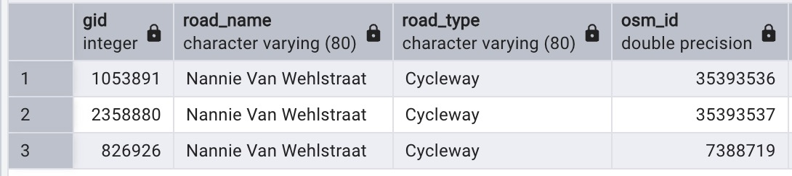

# 12% and counting

## “Street names are more than just navigational tools; they're memories etched into our neighborhoods.”

#### Project Summary
This project explores gender representation in Amsterdam's street names. Using PostGIS within PostgreSQL for spatial analysis and GeoPandas for additional calculations in Python, I categorized street names by gender, plants, places, object, animals and other. The analysis measured both the total number and length of streets associated with each classification in Amsterdam.

## Dataset
<ol>
  <li> Open source data </li>
  <li> Adminstrative boundaries </li>
</ol>

### The following where the steps taken to accomplish the project.

#### 1. Data cleaning
<figure>
    <figcaption>Process</figcaption>
     

Data cleaning was conducted to address redundancies and duplicates, a necessary step before analysis. A prominent issue was the occurrence of multiple OpenStreetMap (OSM) IDs linked to identical road names, which is shown below.
<figure>
    <figcaption>Duplicates</figcaption>
     
To address the multiple OSM ID problem, I performed a geometry union on the road segments sharing identical names, producing a consolidated geometry.

#### 2. Curating data for analysis
<figure>
    <figcaption>Process</figcaption>
     

I categorized the data set into six distinct classifications: gender (female & male), plants, places, animals, objects, and other. Representative examples of these categories are as follows:
<ul>
  <li>Gender: Rembrandt plein, Marie Heineken plein, Nannie van Wehlstraat etc.</li>
  <li>Plants: Lindengracht en -straat,Rozenstraat en -gracht , and similiar.</li>
  <li>Places: Oost, Noord, Westerpark, and similar.</li>
  <li>Animals: Berenstraat,Hartenstraat, and similiar.</li>
  <li>Objects: "molen," "huis," "haven," "kerk," and related terms.</li>
  <li>Other: stars, events, activities, and uncategorized entries."</li>
</ul>

#### 3. Data Analysis
<figure>
    <figcaption>Process</figcaption>
     
For each category, I calculated: the percentage of roads bearing names from that category, the total length of those roads, and the percentage of each road type within that category.

##### Sources
- HDX OSM data, https://data.humdata.org/dataset/hotosm_nld_roads
- DIVA GIS, https://diva-gis.org/data.html 
